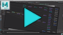

!!!! Maya has many [types](https://help.autodesk.com/view/MAYAUL/2020/ENU/?guid=GUID-21B83FF0-0435-4087-8C2E-23B420028B71) of nodes that serve any number of different functions.  
!!!! All nodes in Maya are considered **DG** nodes, is really at the heart of Maya, it's like a **DNA**.  
 [See: What are nodes and connections in Maya?](https://www.youtube.com/watch?v=hzpz2vksI7Q)  

___
### DG Nodes

The relationship between these nodes is organized by the [Dependency Graph](https://help.autodesk.com/view/MAYAUL/2020/ENU/?guid=GUID-51096BC4-32B7-4391-BE39-21641B374745) (DG), which describes the hierarchical relationship between connected nodes.  
For example, [Utility](https://help.autodesk.com/view/MAYAUL/2020/ENU/?guid=GUID-DA9707D2-8A0D-4911-A010-8274C57D3FD3) nodes are purely DG nodes and cannot be viewed in the viewport.

!!! The DG can be visualized in the [**Node Editor**](https://help.autodesk.com/view/MAYAUL/2020/ENU/?guid=GUID-23277302-6665-465F-8579-9BC734228F69) or the [**Hypergraph**](https://help.autodesk.com/view/MAYAUL/2020/ENU/?guid=GUID-5EC40DB1-FBD9-4553-A2FD-6D3508C9B868)  (Connections mode).  
!!! All DG nodes from scene could be displayed in the [**Outliner**](https://help.autodesk.com/view/MAYAUL/2020/ENU/?guid=GUID-4B9A9A3A-83C5-445A-95D5-64104BC47406) by turning **OFF** in the menu **Display** -> **DAG Objects Only**

___
### DAG Nodes

DAG ([Directed Acyclic Graph](https://help.autodesk.com/view/MAYAUL/2020/ENU/?guid=GUID-5029CF89-D420-4236-A7CF-884610828B70)) is essentially the object hierarchy and compose the [scene hierarchy](https://help.autodesk.com/view/MAYAUL/2020/ENU/?guid=GUID-D71F6D34-FA77-43DC-9BF1-481123A682DC).  
It builds on top of DG and provides a way to describe the parent-child relationships.  

Most of the objects displayed in the Maya viewport are DAG nodes.  
These objects consists of a hierarchy in which the shape is a child of the transform.  

!!! You can visualize the DAG in the **Outliner** or **Hypergraph** (Hierarchy mode).  
!!! This DAG relationship can be modified using the *Parent* (**P**) or *Group* (**Ctrl + G**) commands.  
!!! You can traverse the DAG hierarchy using the arrow keys, **up-down** to navigate the parent-child relationship, and **left-right** to navigate the siblings.  

#### Transform Node
A transform node defines a transformation in space.  
The transformation can be modified by setting the values of `translation`, `rotation` and `scale` attributes.  
A transform node can have any number of children and at most a single parent.  

!!! You can set the **Inherits Transform** attribute to **OFF** to ignore the transformation of its ancestors in the hierarchy.
!!! You can visualize the transform axis in the viewport by turning **ON** in the menu **Display** -> **Transform Display** -> **Local Rotation Axes**  

#### Shape Node
Geometry data is stored in this node, such as mesh, nurbsCurve, locator, ...  
They don't contain parenting or transform informations.  
Shape nodes must have a transformation node as a parent to define where the geometry is located in space.  

___
### DAG Path

A DAG path is expressed in Maya as a string with the nodes in the path separated with the pipe **`|`** character.  
For example: `|pSphere1|pSphereShape1`  

Maya allows DAG nodes to have the same name as long as they are not direct siblings in the DAG hierarchy.  
Therefore a full DAG path provides a unique identifier for a specific DAG node.  

!!!! It's generally a good practice to make sure every node has a **unique** name across the entire scene.  