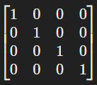

!!!! <i class="fa fa-play-circle"></i> [**Introduction to Matrix & Parent Offset Matrix**](https://www.youtube.com/watch?v=JOYMV-bQdlM)  

In the context of a 3D application, a matrix is simply a representation of a transformation.  
One transformation matrix can encode the translation, orientation, scale and shearing of an object.  

Transformation matrices are stored as 4x4 matrices, meaning they have 4 rows and 4 columns and they look like this:  
  