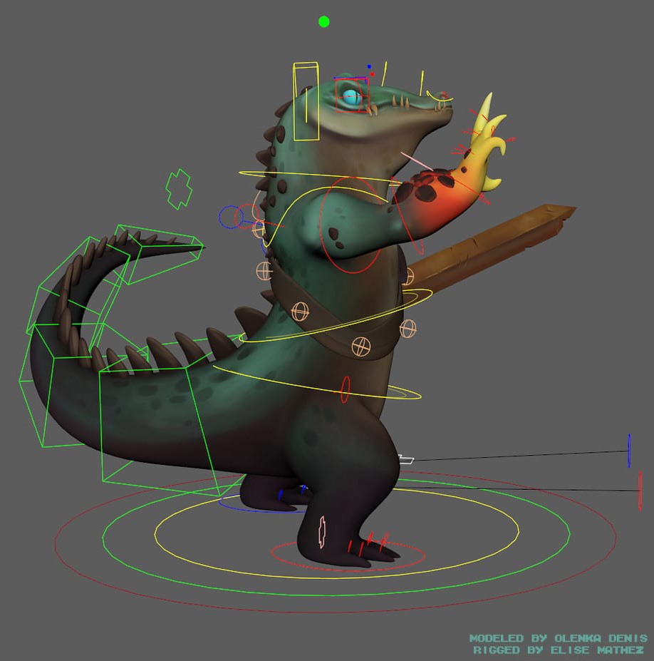

___

#### What is a rig?
Digital rigs are the virtual bones, joints, and muscles that allow models to move. It’s kind of like the strings on a marionette.  
A good rig has just the right amount of flexibility. Without the right controls, the animators can’t create the poses they need.  
Too much flexibility makes posing the model too time consuming.  

#### What does a rigger do?
Riggers start with a virtual 3D model for a character. They study how a character needs to move based on the story.  
Riggers break down those motions into individual elements and create the hundreds of control points that animators will use to create poses.  

 
 
 
___
### Exercice Files

| **File** | **Description**
| :--------- | :--------------------
| [playground.ma]() | Base scene for experimenting with rigging techniques and processes
| [ball_rig_start.ma]() | Base scene for the "Ball Rig" exercice
| [ball_rig_final.ma]() | Final scene of the "Ball Rig" exercise